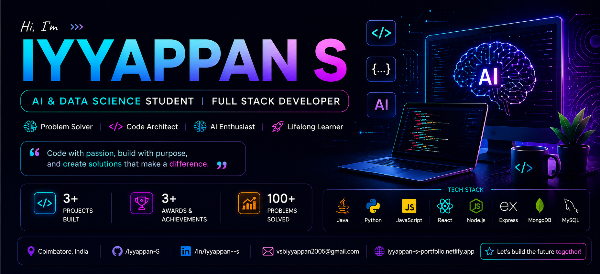
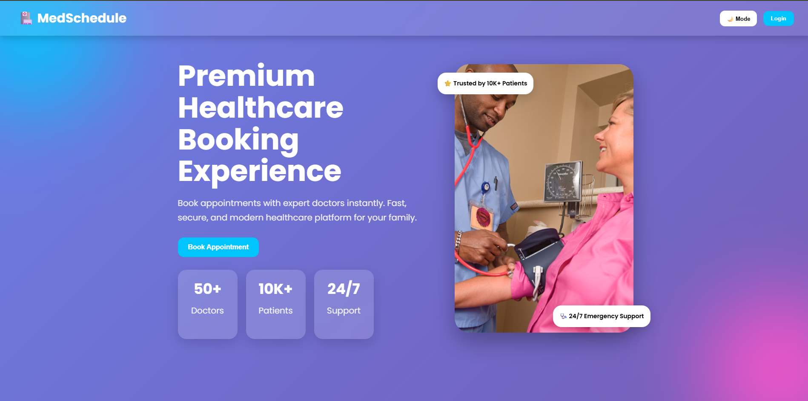
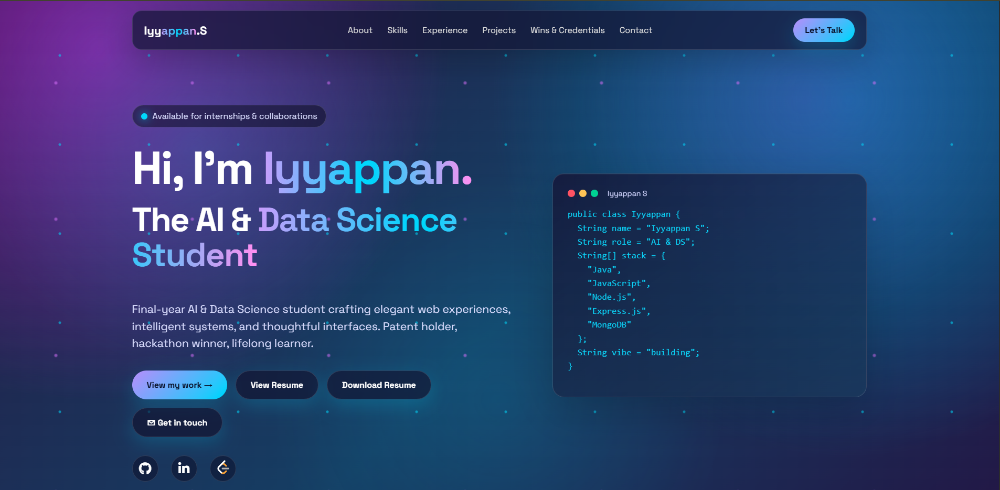
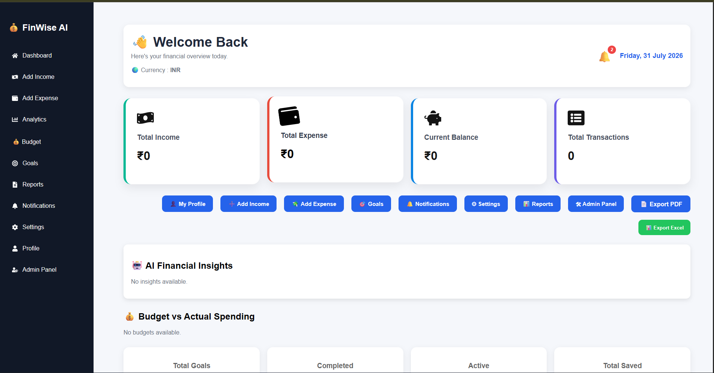

<div align="center">

<br>
<br><br>


<br><br>
<a href="mailto:vsbiyyappan2005@gmail.com">

</a>

<a href="https://www.linkedin.com/in/iyyappan--s/">

</a>

<a href="https://github.com/Iyyappan-S">

</a>

<a href="https://leetcode.com/u/Iyyappan-S/">

</a>

</div>
<div align="center">


</div>

<div align="center">


</div>

# 👨‍💻 About Me

<table>

<tr>

<td width="60%" valign="top">

## 👋 Hello, I'm Iyyappan

🎓 **Final Year B.Tech – Artificial Intelligence & Data Science**

💻 **Full Stack Developer** | ☕ **Java Developer** | 🤖 **AI Enthusiast**

I enjoy building modern web applications, developing scalable backend systems, and solving real-world problems through technology.

### 🚀 Currently Learning

- ⚛️ MERN Stack
- ☕ Advanced Java & DSA
- 🤖 AI & Machine Learning
- ☁️ Cloud Computing
- 🏗️ System Design

### 🎯 Career Goal

Become a **Software Engineer** and build innovative software that creates real-world impact.

### ⚡ Highlights

- 💼 Full Stack Development
- ☕ Java Programming
- 🤖 AI & Data Science
- 🚀 Open Source Explorer
- 📚 Continuous Learner

</td>

<td width="40%" align="center">


<br><br>

### 🚀 Code • Learn • Build

</td>

</tr>

</table>

---

<div align="center">


</div>

# 🛠 Tech Toolbox

<div align="center">

### 💻 Programming Languages


<br><br>

### 🎨 Frontend Development


<br><br>

### ⚙️ Backend Development


<br><br>

### 🗄️ Databases


<br><br>

### 🛠 Tools & Platforms


</div>

<div align="center">


</div>

<div align="center">


</div>

<div align="center">


</div>

# 💼 Internship Experience

<table>

<tr>

<td width="50%" valign="top">

## 🔵 Full Stack Developer Intern

### 🏢 UK InfoTech

📍 Pudukkottai, Tamil Nadu

#### 🚀 Responsibilities

- 💻 Developed responsive web applications
- 🎨 Designed modern user interfaces
- 🔗 Connected frontend with backend APIs
- ⚡ Improved website performance
- 📱 Built mobile-friendly layouts
- 🧪 Tested and debugged web applications

#### 🛠 Technologies Used

`HTML`
`CSS`
`JavaScript`
`Node.js`

</td>

<td width="50%" valign="top">

## 🟣 Backend Developer Intern

### 🏢 Smart Internz

📍 Virtual Internship

#### 🚀 Responsibilities

- ☕ Developed backend modules using Java
- 🗄️ Worked with SQL databases
- 🔗 Built RESTful APIs
- ⚙️ Implemented server-side logic
- 🐞 Debugged backend applications
- 📊 Optimized database operations

#### 🛠 Technologies Used

`Java`
`SQL`
`REST API`

</td>

</tr>

</table>

<div align="center">


</div>

# 🚀 What I Love Building

<div align="center">

| 🌐 Web Apps | 🤖 AI Projects | 📱 Responsive UI | ⚙️ Backend APIs |
|:----------:|:--------------:|:----------------:|:---------------:|
| Modern Websites | Machine Learning | Mobile Friendly | REST Services |

</div>

<div align="center">


</div>

# 💡 Core Skills

```text
☕ Java Programming        ████████████████████ 95%

🌐 Web Development        ██████████████████░ 90%

⚙️ Backend Development    █████████████████░░ 85%

🗄️ Database Management    ████████████████░░░ 80%

🤖 Artificial Intelligence ██████████████░░░░ 70%

📚 Data Structures        ███████████████░░░░ 75%
```

<div align="center">


</div>

<div align="center">


</div>

# 🚀 Featured Projects

<div align="center">

> **Building practical software solutions with modern technologies.**

</div>

<br>

<table>

<tr>

<td width="50%" align="center">

<a href="https://github.com/Iyyappan-S/MedSchedule-Pro">


</a>

### 🏥 MedSchedule Pro

**Doctor Appointment Booking Platform**


<br><br>
<a href="https://github.com/Iyyappan-S/MedSchedule-Pro">>


</a>

</td>

<td width="50%" align="center">

<a href="YOUR_SLE_REPOSITORY_LINK">


</a>

### 🔐 SLE Trifolder Encryption

**Multi-Layer Secure File Encryption**


<br><br>

<a href="https://github.com/jaya-byte12/Pyshield-USB-Data-Leak-Protection-PUDLP-">


</a>

</td>

</tr>

<tr>

<td width="50%" align="center">

<a href="https://github.com/Iyyappan-S/Portfolio">



</a>

### 🌐 Portfolio Website

**Modern Personal Developer Portfolio**


<br><br>

<a href="https://github.com/Iyyappan-S/Portfolio">


</a>

</td>


<td width="50%" align="center">

<a href="https://github.com/Iyyappan-S/finwise-ai">



</a>

### 💰 FinWise AI

**AI-Powered Personal Finance Tracker**


<br><br>

<a href="https://github.com/Iyyappan-S/finwise-ai">

</a>

<a href="https://finwise-ai-r2dn.vercel.app">

</a>

</td>


</tr>

</table>

<div align="center">


</div>

## ⭐ Project Highlights

<div align="center">

| 🚀 Projects | 💻 Technologies | 🎯 Focus |
|:-----------:|:--------------:|:--------:|
| **3+ Completed Projects** | **Java • MERN • Python** | **Full Stack Development & AI** |

</div>

<div align="center">


</div>

<div align="center">


</div>

# 🧩 LeetCode Journey

<div align="center">

<a href="https://leetcode.com/u/Iyyappan-S/">


</a>

</div>

<div align="center">


</div>


<div align="center">

### 🚀 My Coding Journey

> *"Consistency beats intensity. Every solved problem is one step closer to becoming a better Software Engineer."*

</div>

# 📊 GitHub Analytics

<div align="center">


<br><br>


</div>

<div align="center">


</div>

<div align="center">


</div>

# 📈 Contribution Graph

<div align="center">


</div>

<div align="center">


</div>

<div align="center">


</div>


# 📌 GitHub Snapshot

<div align="center">

| 📂 Public Repositories | ⭐ Projects Built | ☕ Primary Language | 🚀 Current Focus |
|:----------------------:|:----------------:|:------------------:|:----------------:|
| Growing Every Day 📈 | **3+** | **Java** | **Full Stack + AI** |

</div>

<div align="center">


</div>

<div align="center">


</div>

# 🐍 Contribution Snake

<div align="center">

<picture>
  <source media="(prefers-color-scheme: dark)" srcset="https://raw.githubusercontent.com/Iyyappan-S/Iyyappan-S/output/github-contribution-grid-snake-dark.svg">
  <source media="(prefers-color-scheme: light)" srcset="https://raw.githubusercontent.com/Iyyappan-S/Iyyappan-S/output/github-contribution-grid-snake.svg">
  
</picture>

</div>

<div align="center">


</div>

<div align="center">


</div>


# 🎯 Current Focus

<div align="center">

| 🚀 Learning | 💼 Building | 📚 Improving | 🤝 Exploring |
|:-----------:|:----------:|:------------:|:------------:|
| MERN Stack | Full Stack Apps | Java + DSA | Artificial Intelligence |

</div>

<br>

```text
☕ Java Programming

█████████████████████░░ 95%

🌐 Full Stack Development

███████████████████░░░ 90%

⚙️ Backend Development

█████████████████░░░░ 85%

🗄 Database Management

████████████████░░░░░ 80%

🤖 Artificial Intelligence

██████████████░░░░░░░ 70%

📚 Data Structures

███████████████░░░░░░ 75%
```

<div align="center">


</div>

<div align="center">


</div>


## 💻 Technical Goals

✅ Master MERN Stack

✅ Build AI-Based Applications

✅ Improve Java & DSA

✅ Learn System Design

✅ Contribute to Open Source

</td>

<td width="50%">

# 🚀 Why Hire Me?

<div align="center">

| 💼 Strengths | 🚀 Value |
|:------------:|:--------:|
| ☕ Java | Strong OOP & DSA Foundation |
| 🌐 Full Stack | Build End-to-End Web Applications |
| 🤖 AI | AI & Data Science Knowledge |
| ⚡ APIs | REST API Development |
| 📱 UI | Responsive & Modern Interfaces |
| 📚 Learning | Quick Learner & Adaptable |

</div>

---

# 🌟 Motto

<div align="center">

> **"Learn • Build • Improve • Repeat"**

</div>

---

<div align="center">


</div>

# 💖 Thanks for Visiting

<div align="center">


<br>

⭐ **If you like my work, don't forget to ⭐ my repositories and follow my GitHub profile.**

</div>

---

<div align="center">

<a href="https://github.com/Iyyappan-S?tab=followers">

</a>

<a href="https://github.com/Iyyappan-S">

</a>

</div>

---

<div align="center">

## ⭐ Code • Learn • Build • Repeat ⭐


</div>
